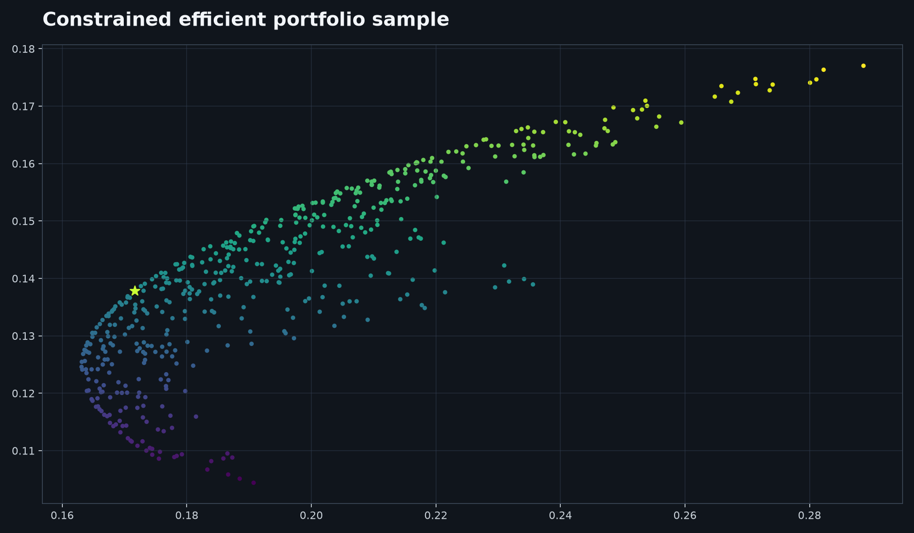

# Markowitz Portfolio Optimizer

[Live dashboard](https://markowitz-portfolio-optimizer.vercel.app)



Constrained mean-variance allocation with explicit return, risk, and concentration assumptions.

```bash
pip install -e . pytest ruff
portfolio-optimizer --tickers AAPL MSFT NVDA --objective max-sharpe --max-weight .35
pytest && ruff check . && ruff format --check .
```

The optimizer symmetrizes and lightly stabilizes the covariance matrix but cannot make an infeasible target return feasible. Historical parameters are uncertain.

## Complete local setup

Use Python 3.12 or later. Create a virtual environment with `python -m venv .venv`, activate it using `.venv/Scripts/Activate.ps1` on Windows or `source .venv/bin/activate` on macOS/Linux, then run the install command. The example downloads adjusted price history through yfinance, estimates returns and covariance, and prints a constrained allocation. `--max-weight .35` limits any one asset to 35%; use a smaller ticker list when first validating a new environment.

## Troubleshooting and limits

An empty data error usually means a ticker is invalid, delisted, too new for the requested period, or yfinance is temporarily unavailable. An infeasible target-return objective is expected when the target conflicts with the allocation bounds; adjust the target or constraints rather than disabling the check. Historical return estimates, covariance, taxes, costs, liquidity, and regime changes are not predictions.

## Verification

Run `ruff check . && ruff format --check . && pytest` before publishing changes. Review weights and constraints manually; this research optimizer does not place orders.

This project is intended for educational and research purposes only. It does not provide investment advice, and its outputs should not be used as the sole basis for financial decisions. Historical performance and simulated results do not guarantee future performance.

MIT License. Author: Aarav Shah.
